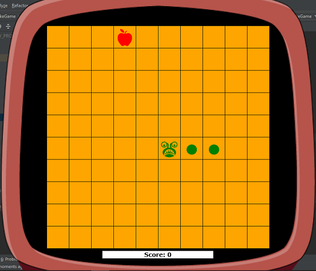
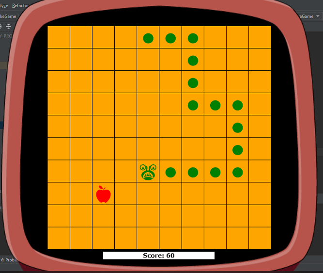
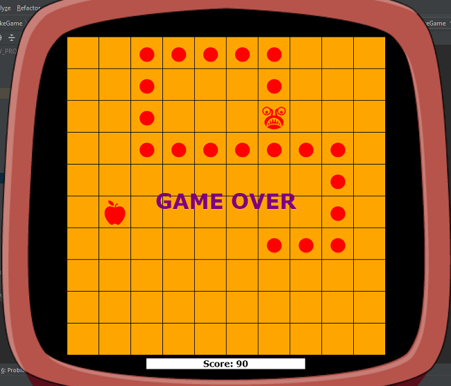
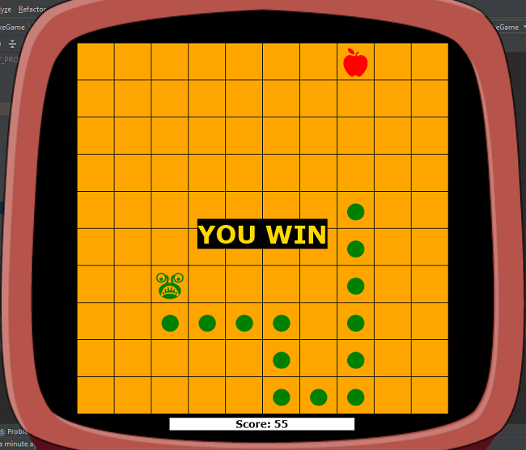

# Snake 2D

## Table of contents
* [General info](#general-info)
* [Technologies](#technologies)
* [Setup](#setup)
* [View](#view)

## General info
The Game - Snake 2D is an application written in Java.  
The objective of the game is to eat all apples and reach the maximum score.   
Move the snake around with the arrow keys and try to avoid hitting yourself!  

	
## Technologies
Project created with:
* Java: 1.8
* lib: desktop-game-engine.jar
	
## Setup
To run this project, create a simple java application and copy the source code.  
Download the desktop-game-engine.jar.  
Then add the downloaded .jar file to your IDE in the library section.

## View
After starting the application, the game will start.  
You will see the gaming board with snake and apple  

During the game, the player will earn scores for eating an apple.  
  

If the player's snake hits it's tail the game is over  
  

To win the game snake should eat all appeared apples on the gameboard.
  
